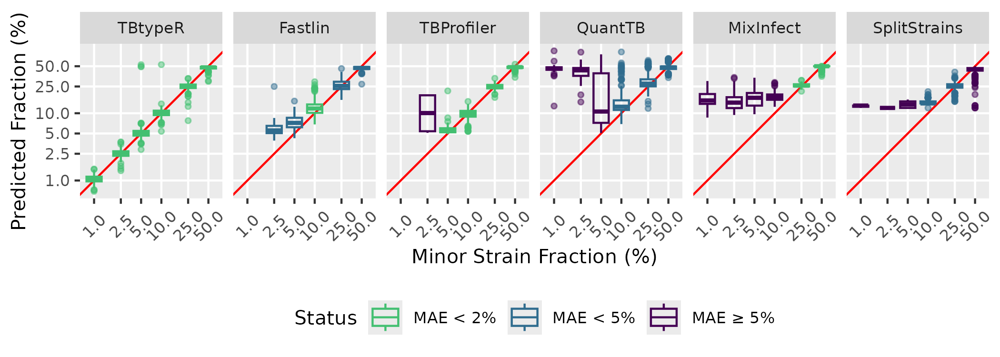

# TBtypeR 

`TBtypeR` is an R package for accurate and sensitive quantification of
mixtures of *M. tuberculosis* (MTB) strains from whole genome sequencing
data. `TBtypeR` excels as detecting low-frequency mixed infections that
other tools struggle to detect, maintaining a sensitivity of ~85% for
minor strain frequencies of 2.5%, and ~55% for minor strain frequencies
of 1%. `TBtypeR` is implemented as a standalone R package and as part of
a end-to-end Nextflow pipeline, `TBtypeNF`.

## Performance

Extensive benchmarking of TBtypeR against available tools for MTB
mixture detection is detailed in our [preprint on
MedRxiv](https://doi.org/10.1101/2024.06.12.24308870). TBtypeR has the
highest accuracy in prediction of minor strain fractions, with other
tools unable to accurately detect or quantify mixtures below 5%:


## The Nextflow Pipeline: TBtypeNF

`TBtypeNF` is a [Nextflow](https://www.nextflow.io/index.html) pipeline
for `TBtypeR` that takes FASTQ files as input and performs FASTQ
preprocessing with [fastp](https://github.com/OpenGene/fastp), read
alignment with [BWA-MEM](https://github.com/lh3/bwa), variant calling
with [BCFtools](https://samtools.github.io/bcftools/bcftools.html), and
quality control report generation using
[SAMtools](https://www.htslib.org/) and
[mosdepth](https://github.com/brentp/mosdepth). Variant calls from
BCFtools are then passed to TBtypeR to identify MTBC lineages and
mixtures. The output is an HTML report with detected MTBC strains and
mixtures frequencies.

`TBtypeNF` requires a sample manifest in TSV format with column names
“sample”, “fastq1” and “fastq2” - see [example
manifest](TBtypeNF/resources/lung_example_manifest.tsv).

### Requirements

- Nextflow (≥ 22.03.0)
- Singularity (Apptainer) or Docker

### Usage Example

``` bash
# download example manifest
wget https://raw.githubusercontent.com/bahlolab/TBtypeR/main/TBtypeNF/resources/lung_example_manifest.tsv -O my_manifest.tsv
# run the nextflow pipeline
nextflow run bahlolab/TBtypeR/TBtypeNF/main.nf -r main -profile singularity --manifest my_manifest.tsv
```

### TBtypeNF Parameters

| Parameter | Description | Default Value |
|----|----|----|
| manifest | Input sample manifest | null |
| id | Run identifier, for naming output files | ‘TBtypeNF-run’ |
| outdir | Output files directory | ‘output’ |
| publish_bams | Save BAM files to output directory | false |
| fast | Run FastTBtypeNF workflow | false |
| max_mix | Maximum number of strains in a mixture to be detected | 3 |
| min_mix_prop | Minimum mixture proportion to be detected | 0.005 |

#### FastTBtypeNF

A faster workflow which skips alignment and quality control reporting is
implemented by using [Fastlin](https://github.com/rderelle/fastlin) to
generate allele counts for use by TBtypeR. This is generally 10x faster
to run and gives near identical results. To use this mode supply the
parameter `--fast` on the command line, e.g.:

``` bash
nextflow run bahlolab/TBtypeR/TBtypeNF/main.nf -r main -profile singularity --manifest my_manifest.tsv --fast
```

## The R package: TBtypeR

The easiest way to use `TBtypeR` is through the `TBtypeNF` pipeline.
However, additional parameters and customisation is available by using
the R package directly. `TBtypeR` can be installed with `devtools` as
follows:

``` r
devtools::install_github("bahlolab/TBtypeR")
```

### VCF Requirements

It is recommended to either use TBtypeNF or [BCFtools
Call](https://samtools.github.io/bcftools/bcftools.html#call) to
generate VCF files for TBtypeR. VCF files generated by other software
may be compatible if the following conditions are met:  
1) **Reference Genome**: TBtypeR expects variants to be called angainst
the [H37Rv (ASM19595v2) reference
genome]('https://ftp.ncbi.nlm.nih.gov/genomes/all/GCA/000/195/955/GCA_000195955.2_ASM19595v2/GCA_000195955.2_ASM19595v2_genomic.fna.gz').
The chromosome name in your VCF file should be “AL123456.3”.  
2) **AD Format Field**: TBtypeR requires the allelic depth to be stored
in the VCF format field AD, consistent with BCFtools call output.

Example usage of `TBtypeR`:

``` r
library(tidyverse)
library(TBtypeR)

# replace with path to your VCF file
vcf_filename <- system.file('vcf/example.vcf.gz', package = 'TBtypeR')

tbtype_result <- 
  # generate TBtypeR results
  tbtype(vcf = vcf_filename) %>% 
  # filter TBtypeR results
  filter_tbtype(max_phylotypes = 3) %>%
  # unnest data so there is 1 row per identified Mtb strain in each sample
  unnest_mixtures()

tbtype_result %>% 
  select(sample_id, n_phy, mix_phylotype, mix_prop) %>% 
  knitr::kable()
```

| sample_id   | n_phy | mix_phylotype | mix_prop |
|:------------|------:|:--------------|---------:|
| SRR13312530 |     2 | 4.2.1         |   0.8579 |
| SRR13312530 |     2 | 4.3.3         |   0.1421 |
| SRR13312531 |     1 | 4.3.3         |   1.0000 |
| SRR13312533 |     2 | 4.3.3         |   0.9192 |
| SRR13312533 |     2 | 4.2.1         |   0.0808 |

Visualise mixtures:

``` r
tbtype_result %>% 
  ggplot(aes(x = sample_id,
             y = mix_prop,
             fill = mix_phylotype)) +
  geom_col() +
  coord_flip() +
  labs(x = 'Sample ID',
       y = 'Minor Strain Fraction (%)', 
       fill = 'Sublineage') +
  theme(text = element_text(size = 6))
```

<!-- -->

Detailed usage guides for the `tbtype` and `filter_tbtype` functions are
available in the package documentation by running `help(tbtype)` or
`help(filter_tbtype)`.

## Citation

TBtypeR is published as a preprint on MedRxiv:

- [Munro, J. E., Coussens, A. K., & Bahlo, M. (2024). TBtypeR: Sensitive
  detection and sublineage classification of low-frequency Mycobacterium
  tuberculosis complex mixed infections. *medRxiv*,
  2024-06](https://doi.org/10.1101/2024.06.12.24308870)
