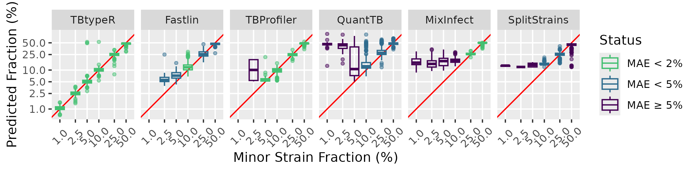
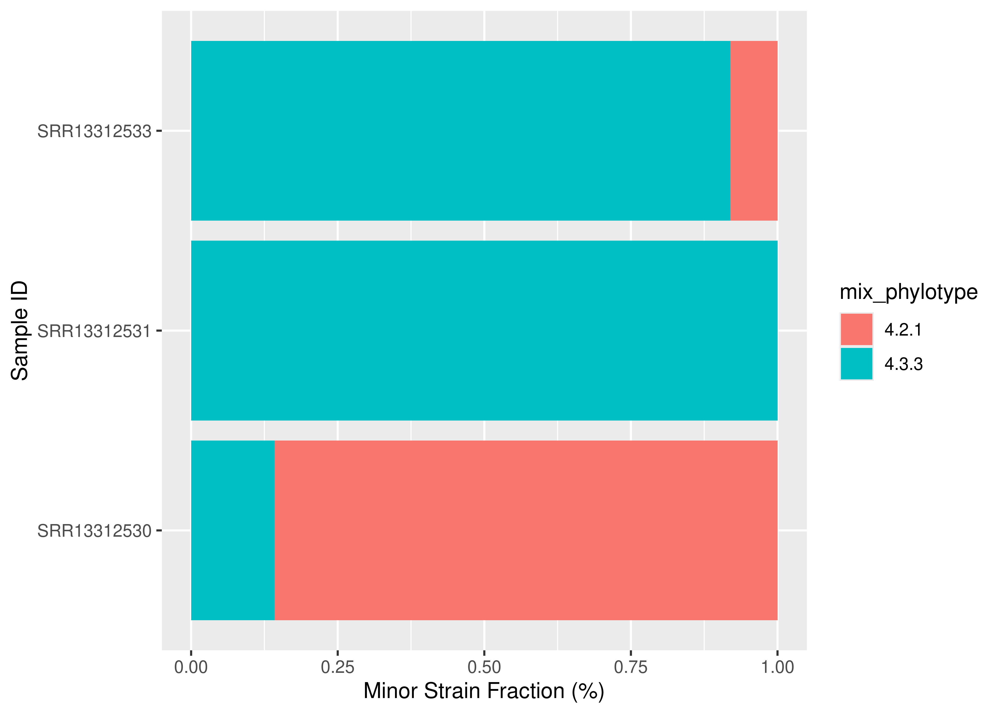

# TBtypeR 

[](https://doi.org/10.1038/s42003-025-07705-9)
[](https://doi.org/10.5281/zenodo.14715907)

`TBtypeR` enables **accurate and sensitive quantification** of
*Mycobacterium tuberculosis* (MTB) strain mixtures from whole genome
sequencing (WGS) data. It is designed to detect **low-frequency mixed
infections** that other tools struggle to identify, with frequencies as
low as 1%.

`TBtypeR` is available as a **standalone R package** and as part of an
**end-to-end Nextflow pipeline**, `TBtypeNF`, which automates data
processing from raw sequencing reads to final results.

### Performance

Extensive benchmarking, detailed in our [publication in Communications
Biology](https://www.nature.com/articles/s42003-025-07705-9), shows that
**TBtypeR has the highest accuracy** in predicting minor strain
fractions. Competing tools fail to **accurately detect or quantify
mixtures** below **5%**.


### How TBtypeR Works

TBtypeR models **reference and alternative allele counts** at
**phylogenetic SNP sites** using a **binomial distribution**. These
sites, known as the **SNP barcode**, are compiled from multiple studies:

| Publication | Lineages | Unique SNPs | \# Sublineages |
|----|----|----|----|
| [Napier et al.](https://doi.org/10.1186/s13073-020-00817-3) | L1-L9,La1-La3 | 7572 | 78 |
| [Zwyer et al.](https://doi.org/10.12688/openreseurope.14029.2) | La1-La3 | 1323 | 19 |
| [Thawornwattana et al.](https://doi.org/10.1099/mgen.0.000697) | L2 | 728 | 42 |
| [Coscolla et al.](https://doi.org/10.1099/mgen.0.000477) | L5,L6 | 643 | 16 |
| [Shuaib et al.](https://doi.org/10.3390/genes13060990) | L3 | 637 | 12 |

# The Nextflow Pipeline: TBtypeNF

`TBtypeNF` is a [Nextflow](https://www.nextflow.io/index.html) pipeline
that **automates MTB mixture detection** from raw sequencing reads. It
integrates:

- FASTQ preprocessing with [fastp](https://github.com/OpenGene/fastp)
- Read alignment with [BWA-MEM](https://github.com/lh3/bwa)
- Variant calling with
  [BCFtools](https://samtools.github.io/bcftools/bcftools.html)
- Quality control with [SAMtools](https://www.htslib.org/),
  [mosdepth](https://github.com/brentp/mosdepth) and
  [multiQC](https://docs.seqera.io/multiqc)
- MTB lineage & mixture detection with `TBtypeR`

The pipeline generates an **HTML report** with detected MTB strains and
mixture proportions.

We **strongly recommend using pipeline** where possible as it ensures
data is extracted from all phylogenetic SNP sites, **maximising accuracy
and sensitivity**.

`TBtypeNF` requires a sample manifest in TSV format with column names
“sample”, “fastq1” and “fastq2” - see [example
manifest](TBtypeNF/resources/lung_example_manifest.tsv).

### Requirements

- [Nextflow](https://www.nextflow.io/) (≥ 22.03.0)
- Singularity/Apptainer or Docker

### Running the Pipeline

``` bash
# download example manifest
wget https://raw.githubusercontent.com/bahlolab/TBtypeR/main/TBtypeNF/resources/lung_example_manifest.tsv -O my_manifest.tsv

# run the nextflow pipeline
nextflow run bahlolab/TBtypeR/TBtypeNF/main.nf -r main -profile singularity --manifest my_manifest.tsv
```

To use Docker instead of Singularity, replace `-profile singularity`
with `-profile docker`.

### TBtypeNF Parameters

| Parameter | Description | Default Value |
|----|----|----|
| manifest | Input sample manifest | null |
| id | Run identifier, for naming output files | ‘TBtypeNF-run’ |
| outdir | Output files directory | ‘output’ |
| publish_bams | Save BAM files to output directory | false |
| fast | Run FastTBtypeNF workflow | false |
| max_mix | Maximum number of strains in a mixture to be detected | 3 |
| min_mix_prop | Minimum mixture proportion to be detected | 0.005 |

# The R package: TBtypeR

The easiest way to use `TBtypeR` is through the `TBtypeNF` pipeline.
However, additional parameters and customisation is available by using
the R package directly. `TBtypeR` can be installed with `devtools` as
follows:

``` r
devtools::install_github("bahlolab/TBtypeR")
```

### Data Requirements

#### Minimum Coverage Recommendations

| Mixture Frequency | Recommended Coverage |
|-------------------|----------------------|
| ≥ 5%              | **≥20×**             |
| ≥ 2.5%            | **≥40×**             |
| ≥ 1%              | **≥60×**             |

#### VCF Requirements

It is recommended to either use TBtypeNF or [BCFtools
Call](https://samtools.github.io/bcftools/bcftools.html#call) to
generate VCF files for TBtypeR. Input VCF files must:

1)  **Use H37Rv Genome**: [Download from NCBI
    here]('https://ftp.ncbi.nlm.nih.gov/genomes/all/GCA/000/195/955/GCA_000195955.2_ASM19595v2/GCA_000195955.2_ASM19595v2_genomic.fna.gz').
    The chromosome must be named either “AL123456.3” or “NC_000962.3”.  
2)  **Contain AD Field**: TBtypeR requires the VCF **AD** (allelic
    depth) format field, as generated by `BCFtools call`.  
3)  **Include SNP Barcode Sites**: Coverage of the majority of TBtypeR
    SNP barcode sites.

To generate a compatible VCF using BCFtools:

``` bash
# Download TBtypeR SNP barcode
wget https://github.com/bahlolab/TBtypeR/raw/refs/heads/main/TBtypeNF/resources/tbt_panel.tsv.bz2

# Reformat for BCFtools call
bzcat tbt_panel.tsv.bz2 | tail -n+2 | awk 'BEGIN { FS = OFS = "\t" } { print $1, $2, $3 "," $4 }' > tbtyper_targets.tsv

# Call variants with BCFtools
bcftools mpileup <SAMPLE_1>.bam -q 1 -Q 10 -d 200 -f <REFERENCE_FASTA> -a FMT/AD -Ou \
  | bcftools call -A -m --prior 1e-2 -C alleles -T tbtyper_targets.tsv -Ou \
  | bcftools annotate -x INFO,^FORMAT/GT,^FORMAT/AD -Oz -o <SAMPLE_1>.vcf.gz
```

Example usage of `TBtypeR`:

``` r
library(tidyverse)
library(TBtypeR)

# replace with path to your VCF file
vcf_filename <- system.file('vcf/example.vcf.gz', package = 'TBtypeR')

tbtype_result <- 
  # generate TBtypeR results
  tbtype(vcf = vcf_filename) %>% 
  # filter TBtypeR results
  filter_tbtype(max_phylotypes = 3) %>%
  # unnest data so there is 1 row per identified Mtb strain in each sample
  unnest_mixtures()

tbtype_result %>% 
  select(sample_id, n_phy, mix_phylotype, mix_prop) %>% 
  knitr::kable()
```

| sample_id   | n_phy | mix_phylotype | mix_prop |
|:------------|------:|:--------------|---------:|
| SRR13312530 |     2 | 4.2.1         |   0.8579 |
| SRR13312530 |     2 | 4.3.3         |   0.1421 |
| SRR13312531 |     1 | 4.3.3         |   1.0000 |
| SRR13312533 |     2 | 4.3.3         |   0.9192 |
| SRR13312533 |     2 | 4.2.1         |   0.0808 |

Visualise mixtures:

``` r
tbtype_result %>% 
  ggplot(aes(x = sample_id,
             y = mix_prop,
             fill = mix_phylotype)) +
  geom_col() +
  coord_flip() +
  labs(x = 'Sample ID',
       y = 'Minor Strain Fraction (%)', 
       fill = 'Sublineage') +
  theme(text = element_text(size = 6))
```

<!-- -->

Detailed usage guides for the `tbtype` and `filter_tbtype` functions are
available in the package documentation by running `help(tbtype)` or
`help(filter_tbtype)`.

## Citation

If you use **TBtypeR**, please cite:

> **Munro, J. E., Coussens, A. K., & Bahlo, M.** (2025). TBtypeR:
> Sensitive detection and sublineage classification of *Mycobacterium
> tuberculosis* complex mixed-strain infections. *Communications
> Biology*, 8(1), 260.  
> [DOI:
> 10.1038/s42003-025-07705-9](https://doi.org/10.1038/s42003-025-07705-9)
