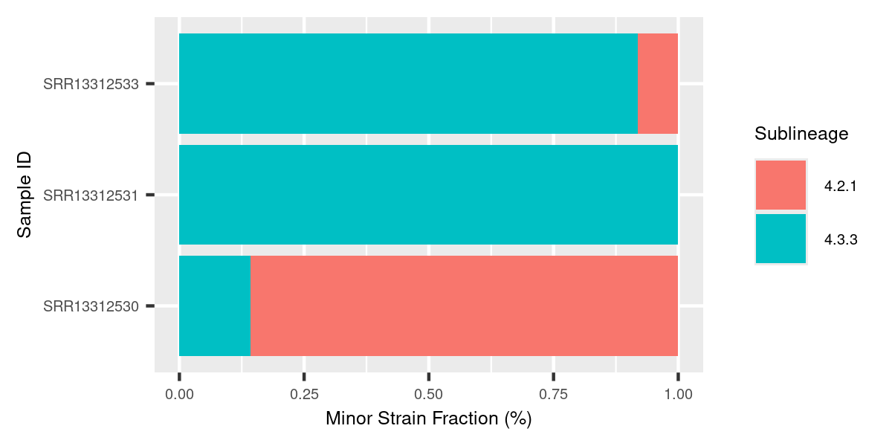

TBtypeR
================

`TBtypeR` is an R package that performs accurate and sensitive
quantification of mixtures of *M. tuberculosis* (MTB) strains from whole
genome sequencing (WGS) data. `TBtypeR` excels as detecting
low-frequency mixed infections that other tools struggle to detect,
maintaining a sensitivity of 85% down to minor strain frequencies of
2.5%.

## Running TBtypeNF

`TBtypeNF` is an end-to-end
[Nextflow](https://www.nextflow.io/index.html) pipeline for `TBtypeR`
that takes FASTQ files as input and performs FASTQ preprocessing with
[fastp](https://github.com/OpenGene/fastp), read alignment with
[BWA-MEM](https://github.com/lh3/bwa), variant calling with
[BCFtools](https://samtools.github.io/bcftools/bcftools.html), and
quality control (QC) report generation using
[SAMtools](https://www.htslib.org/),
[mosdepth](https://github.com/brentp/mosdepth). The output is an HTML
report with detected MTBC strains and mixtures frequencies.

`TBtypeNF` requires a sample manifest to run, minimally a TSV file with
column names “sample”, “fastq1” and “fastq2” - see [example
manifest](TBtypeNF/resources/lung_example_manifest.tsv).

### Requirements

- Nextflow (≥ 22.03.0)
- Singularity (Apptainer) or Docker

### Usage

``` bash
# download example manifest
wget https://raw.githubusercontent.com/bahlolab/TBtypeR/main/TBtypeNF/resources/lung_example_manifest.tsv -O my_manifest.tsv
# run the nextflow pipeline
nextflow run bahlolab/TBtypeR/TBtypeNF/main.nf -r main -profile singularity --manifest my_manifest.tsv
```

## Using TBtypeR

The recommended way to use `TBtypeR` is through the `TBtypeNF` pipeline.
However, additional parameters and customisation is available by using
the R package directly. `TBtypeR` can be installed with `devtools` as
follows:

``` r
devtools::install_github("bahlolab/TBtypeR")
```

Example usage of `TBtypeR` as follows:

``` r
library(SeqArray)
library(tidyverse)
library(TBtypeR)

# replace with path to your VCF file
vcf_filename <- system.file('vcf/example.vcf.gz', package = 'TBtypeR')

tbtype_result <- 
  tbtype(vcf = vcf_filename) %>% 
  filter_tbtype(max_phylotypes = 3) %>%
  unnest_mixtures()

tbtype_result %>% 
  knitr::kable()
```

| sample_id   | n_phy | likelihood | error_rate | p_val_perm | p_val_wsrst | abs_diff | mix_index | mix_node | mix_phylotype | mix_prop | failed |
|:------------|------:|-----------:|-----------:|-----------:|------------:|---------:|----------:|---------:|:--------------|---------:|:-------|
| SRR13312530 |     2 |  -1103.386 |  0.0001000 |          0 |           0 |   9.0944 |         1 |      129 | 4.2.1         |   0.8579 | FALSE  |
| SRR13312530 |     2 |  -1103.386 |  0.0001000 |          0 |           0 |   9.0944 |         2 |       10 | 4.3.3         |   0.1421 | FALSE  |
| SRR13312531 |     1 |  -2109.143 |  0.0009222 |          0 |          -1 |      Inf |         1 |       10 | 4.3.3         |   1.0000 | FALSE  |
| SRR13312533 |     2 |  -2120.992 |  0.0009222 |          0 |           0 |   5.1712 |         1 |       10 | 4.3.3         |   0.9192 | FALSE  |
| SRR13312533 |     2 |  -2120.992 |  0.0009222 |          0 |           0 |   5.1712 |         2 |      129 | 4.2.1         |   0.0808 | FALSE  |

``` r
tbtype_result %>% 
  ggplot(aes(x = sample_id, y = mix_prop, fill = mix_phylotype)) +
  geom_col() +
  coord_flip()
```

<!-- -->
